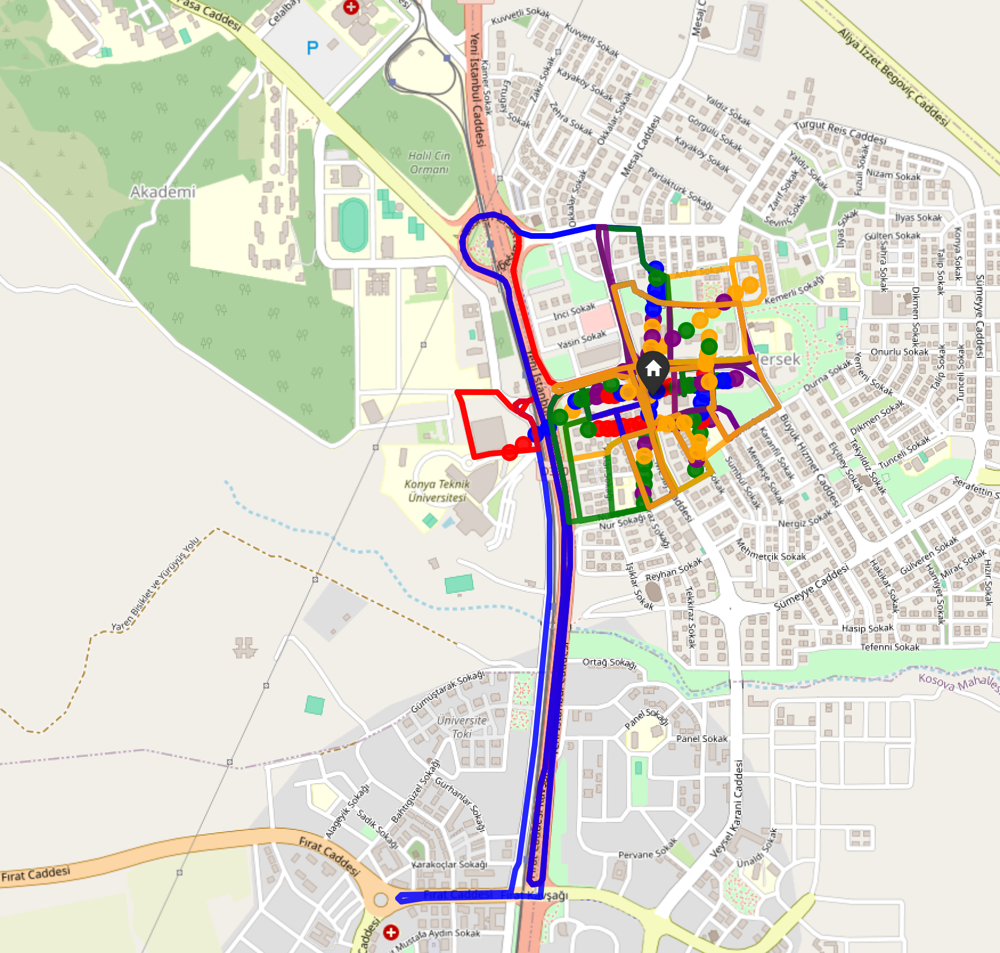
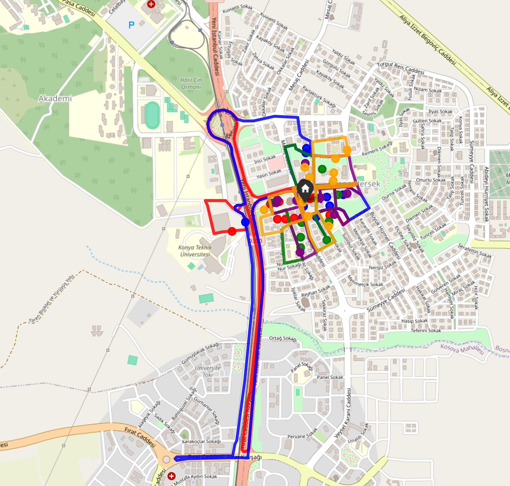
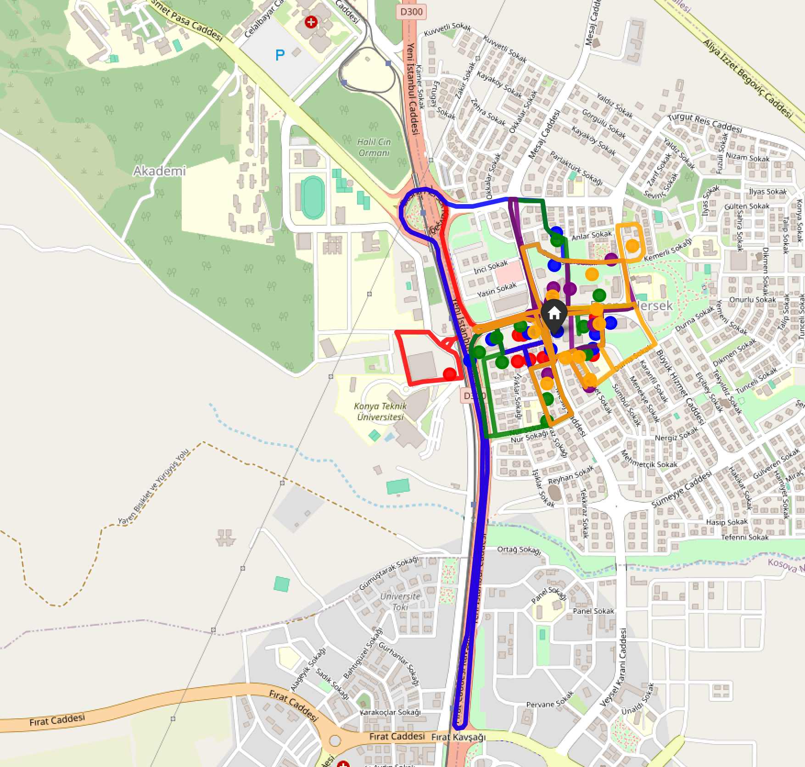

# RouteOptimizerLSTM

Bu repo, konteyner doluluk tahmini ile rota optimizasyonunu birleştirerek sabah ve akşam vardiyaları için toplama planı üretir.

> Bu `README`, **04 Nisan 2026** itibarıyla yapılan güncellemelerin, doğrulama çıktılarının ve mevcut sınırlamaların **şeffaf özeti** olarak hazırlanmıştır.

---

## 🎯 Amaç

Sistemin hedefi:

- doluluk oranını **yalnızca filtre** olarak kullanmak,
- yeterince dolu konteynerleri seçmek,
- seçilen konteynerleri **sabah ve akşam vardiyalarına bölmek**,
- her vardiyada **tam 5 kamyon** çalıştırmak,
- mümkün olduğunca **gerçek yol ağı** üzerinden rota üretmek,
- kamyonlar arası mesafe farkını düşürmektir.

---

## ✅ Bu Turda Yapılan Değişiklikler

### 1) Veri seti kaynağı güncellendi
Eski 3 aylık veri yolu yerine yeni 1 haftalık veri seti kullanılacak şekilde güncellendi:

- `data/cop_veri_seti.xlsx`

Güncellenen dosyalar:

- `src/data_preprocessing.py`
- `src/lstm_model.py`
- `src/route_optimizer.py`

Ayrıca veri dosyasında header kayması olasılığına karşı daha güvenli okuma mantığı eklendi.

### 2) LSTM eğitim akışı güçlendirildi
Aşağıdaki iyileştirmeler yapıldı:

- `epochs` değeri artırıldı: **5 → 25**
- `EarlyStopping` eklendi
- scaler kaydı eklendi: `models/doluluk_scaler.pkl`

> Not: `route_optimizer.py`, scaler dosyası yoksa çalışmayı durdurmaz; güvenli fallback ile devam eder.

### 3) Rota dağıtımı 5 kamyona zorlandı
Rota mantığı yeniden düzenlendi:

- her vardiyada **5 kamyon** oluşturuluyor,
- konteyner dağıtımı artık **eşit sayıda değil**, mesafe bazlı dengeleme öncelikli olacak şekilde yapılıyor,
- uzak güzergahlara daha az konteyner atanarak kamyonlar arası toplam katedilen mesafe farkı azaltılmaya çalışılıyor.

### 4) Mesafeye göre dinamik konteyner dağıtımı eklendi
Yeni algoritma artık konteyner sayısını değil, **kamyon rotalarının toplam mesafesini** eşitlemeyi hedefliyor:

- `route_optimizer.py` içinde kümelendirme ve dengeleme mantığı mesafe tabanlı olarak güncellendi,
- sadece swap değil, rota mesafesi farkını azaltan taşıma/move adımları da değerlendiriliyor,
- eğer dinamik dengeleme önceki duruma göre daha kötü sonuç verirse, stabil baseline hâliyle kalacak şekilde fallback mantarı konuldu.

### 5) Gerçek yol geometrisiyle harita üretimi eklendi
Harita çizimi artık OSRM `route/v1` kullanarak sokak/yol ağına oturan çizgiler üretir.

Üretilen çıktılar:

- `optimize_rota_haritasi.html`
- `optimize_rota_haritasi_sabah_vardiyasi.html`
- `optimize_rota_haritasi_aksam_vardiyasi.html`

### 🗺️ Harita Önizlemeleri

#### Genel Rota Haritası
[HTML dosyasını aç](./optimize_rota_haritasi.html)



#### Sabah Vardiyası Haritası
[HTML dosyasını aç](./optimize_rota_haritasi_sabah_vardiyasi.html)



#### Akşam Vardiyası Haritası
[HTML dosyasını aç](./optimize_rota_haritasi_aksam_vardiyasi.html)



### 6) macOS ortamı için çalışma kararlılığı sağlandı
Uygulama sırasında **TensorFlow + OR-Tools** birlikte kullanıldığında yerel (`native`) çökme problemi gözlendi.
Bu yüzden mevcut çalışır sürümde rota sıralaması için **NumPy tabanlı greedy + dengeleme iyileştirmesi** kullanıldı.

> Bu bir workaround’dur; sistem şu an çalışıyor, ancak ileride daha güçlü bir solver entegrasyonu yeniden denenebilir.

---

## 📊 Doğrulanmış Sonuçlar

Aşağıdaki sonuçlar doğrudan komut çalıştırılarak doğrulanmıştır.

| Doğrulama | Komut | Sonuç |
|---|---|---|
| Veri ön işleme | `python src/data_preprocessing.py` | **Başarılı** – `1060` adet sequence üretildi |
| Testler | `python -m unittest discover -s tests -v` | **3/3 test geçti** |
| Uçtan uca rota üretimi | `python src/route_optimizer.py` | **Başarılı** – rota raporları ve haritalar üretildi |

### `python src/route_optimizer.py` çıktısından öne çıkanlar

- `%28` üstü doluluğa ulaşacak **100 konteyner** bulundu.
- **Sabah vardiyası:** 5/5 kamyon aktif
- **Akşam vardiyası:** 5/5 kamyon aktif
- Konteyner dağılımı artık **mesafeye göre dinamik** olabiliyor.

### Vardiya bazlı mesafe özeti

| Vardiya | Toplam Mesafe | Ölçülen Maks. Sapma | Hedef |
|---|---:|---:|---:|
| Sabah | `27,949 m` | `%37.8` | `≤ %10` |
| Akşam | `31,002 m` | `%24.9` | `≤ %10` |

> Not: son kod değişiklikleriyle mesafe dengeleme mantığı mesafe tabanlı olarak güncellendi; mevcut ölçüm değerleri önceki sürümün bakiyesini gösteriyor ve yeni dağıtım algoritmasıyla yeniden değerlendirme devam ediyor.

---

## ⚠️ Şeffaf Durum Değerlendirmesi

Bu tur sonunda:

- ✅ **1 haftalık veri setine geçiş tamamlandı**
- ✅ **Doluluk oranı filtre mantığında tutuldu**
- ✅ **Her vardiyada 5 kamyon çıkması sağlandı**
- ✅ **Gerçek yol geometrisiyle harita üretimi çalışıyor**
- ✅ **Kod testi ve veri ön işleme doğrulandı**
- ⚠️ **Mesafe eşitliği hedefi (`±10%`) henüz tam sağlanamadı**

Yani sistem artık **çalışır ve ölçülebilir** durumda, ancak en kritik hedef olan **kamyonlar arası çok sıkı mesafe dengesi** için ek optimizasyon gerekiyor.

---

## 🔍 Neden Hâlâ Mesafe Sapması Var?

Bunun ana nedeni LSTM değil, ağırlıklı olarak rota katmanıdır.
Şu anki sürüm:

- 5 kamyonu garanti ediyor,
- gerçek yol mesafesini kullanıyor,
- dengeleme için artık **mesafe bazlı dinamik konteyner dağıtımı** uygulanıyor,
- otomatik fallback ile yeni strateji beraberinde daha kötü sonuç verirse stabil baseline koruyor.

ancak **çok sıkı (`±10%`) denge** için daha güçlü bir ikinci optimizasyon katmanı gerekebilir.

---

## 🚀 Çalıştırma

### Bağımlılıkları kur
```bash
pip install -r requirements.txt
```

### Veri ön işleme doğrulaması
```bash
python src/data_preprocessing.py
```

### Modeli yeniden eğit
```bash
python src/lstm_model.py
```

### Rotaları üret
```bash
python src/route_optimizer.py
```

---

## 📁 Güncellenen Dosyalar

- `src/data_preprocessing.py`
- `src/lstm_model.py`
- `src/route_optimizer.py`
- `tests/test_route_optimizer.py`

---

## ➕ Sonraki Adım Önerisi

Bir sonraki iterasyonda yapılması önerilen geliştirme:

1. kamyonlar arası mesafe farkını daha da azaltacak **ikinci aşama local-search / swap optimizasyonu**,
2. mümkünse macOS ortamında çakışmayacak biçimde daha güçlü bir solver yaklaşımı,
3. hedefin kademeli olarak önce `%20`, sonra `%10` bandına indirilmesi.

---

## Sonuç

Bu sürüm, istenen dönüşümün önemli kısmını yerine getirir:

- yeni veri seti entegre edilmiştir,
- rota mantığı 5 kamyona göre yeniden düzenlenmiştir,
- haritalar gerçek yol geometrisine yaklaşacak şekilde üretilmektedir,
- mevcut performans açık biçimde raporlanmıştır.

Ancak **nihai mesafe dengeleme hedefi henüz tamamlanmamıştır** ve bu bilinçli olarak burada şeffaf biçimde belirtilmiştir.
